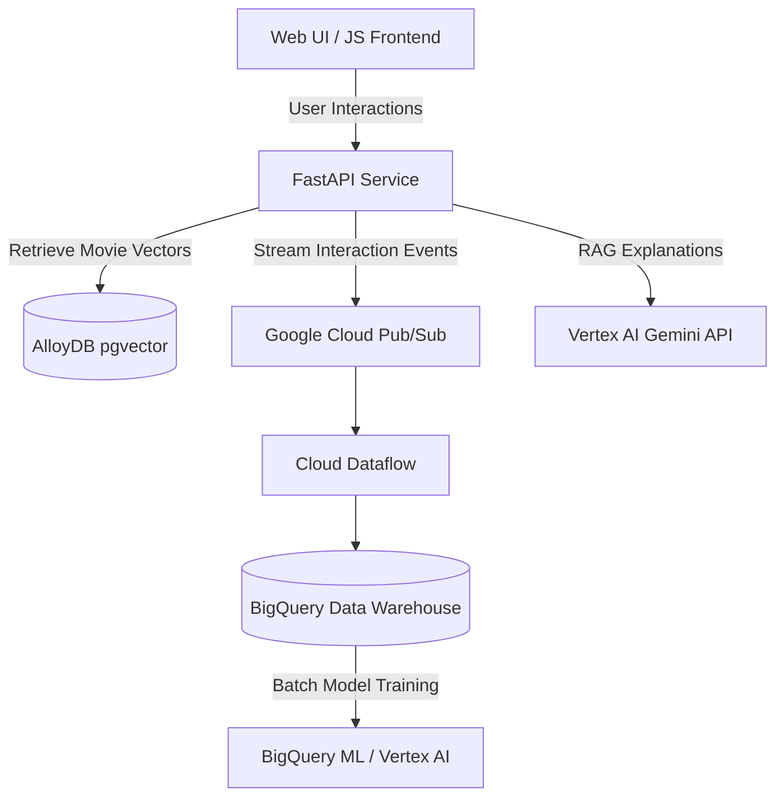

# ☁️ Google Data Cloud Integration & Strategy

This document details the architectural strategy for integrating **Google Data Cloud** services into the **Movie Recommendation Engine** to transition the project from a localized, script-based prototype to a low-latency, scalable production platform.

---

## 1. Context: Movie Recommendation Engine Architecture

The Movie Recommendation Engine combines a **FastAPI backend** (running Python ML libraries) with a **responsive JS frontend**. As the system moves from static datasets (e.g., MovieLens CSVs) to live recommendations for thousands of users, Google Data Cloud services provide critical building blocks.

---

## 2. Integration Architecture

### A. Semantic Search & Embeddings: AlloyDB with `pgvector`
* **Current State:** Local similarity computation (e.g., calculating cosine similarity over TF-IDF matrices in memory).
* **Google Data Cloud Upgrade:** Store movie and genre vector representations in **AlloyDB for PostgreSQL**.
* **Benefits:**
  * **Scalable Similarity Search:** Standard Python in-memory similarity scales poorly. AlloyDB's `pgvector` index (using IVFFlat or HNSW indexes) can query similar vectors across millions of movies in milliseconds.
  * **Hybrid Filtering:** Combine metadata SQL filters (e.g., release year, language) and semantic search vector filters in a single query.

### B. High-Scale Interaction Processing: BigQuery & Pub/Sub
* **Current State:** Local file storage or basic relational table for user ratings.
* **Google Data Cloud Upgrade:** Ingestion with **Pub/Sub** and warehousing in **BigQuery**.
* **Benefits:**
  * **Real-Time Clickstreams:** Capture real-time events (movie details viewed, search terms entered, watch duration) without blocking the FastAPI service.
  * **BigQuery ML (BQML):** Train recommendation models (such as Matrix Factorization or K-Means clustering) directly inside BigQuery using standard SQL queries, avoiding complex ETL pipelines to export data to GPU instances.

### C. Explainable Recommendations & Metadata Enrichment: Vertex AI
* **Current State:** Basic item-to-item or collaborative suggestions with no explanations.
* **Google Data Cloud Upgrade:** **Vertex AI** for embeddings and Gemini text models.
* **Benefits:**
  * **Describe "Why":** Ground the Vertex AI Gemini model with user history (from BigQuery) and movie descriptions (from AlloyDB) to auto-generate personalized sentences explaining the recommendations.
  * **Content Enrichment:** Auto-tag movies with rich semantic tags (mood, pacing, character tropes) using Gemini models to ingest and label raw synopsis texts.

---

## 3. IDE Developer Tooling (Google Cloud Extensions)
The Google Data Cloud developer extensions in Antigravity streamline development workflows:
* **Vertex AI Extensions:** Test prompting and generate vector embeddings directly from IDE workspace configurations.
* **SQL Query Runners:** Direct database execution from the editor to inspect AlloyDB pgvector tables and debug query response speeds.
