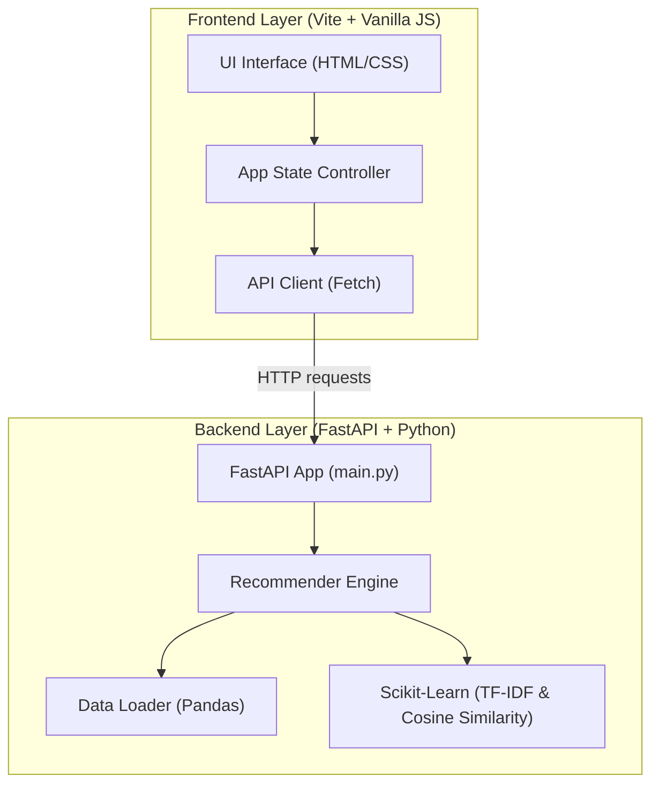
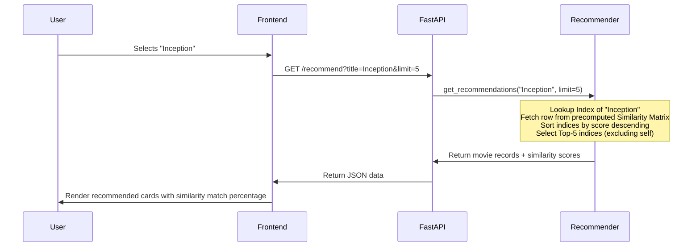

# 🏛️ System Architecture — Movie Recommendation Engine

## Overview

The Movie Recommendation Engine is built as a **hybrid Python-JavaScript application** consisting of a Fast and modern REST API backend and a responsive client-side SPA frontend.

## Module Responsibilities

### 1. Backend Layer (Python)
- **FastAPI Interface**: Exposes endpoints (`/movies`, `/recommend`, `/search`) and returns JSON payloads.
- **Recommender Engine**: Performs TF-IDF Vectorization, builds the similarity matrix, and queries top-K recommendations.
- **Dataset Loader**: Reads a CSV file containing movie titles, overviews, taglines, and genres, doing basic cleaning on load.

### 2. Frontend Layer (JS)
- **UI Shell**: Interactive user interface featuring search inputs, interactive similarity matrices, genre filters, and movie details cards.
- **App State Controller**: Manages current selected movie, search query, genre filters, and active recommendations.
- **API Client**: Handles fetches, error handling, and loading animations.

## Data Flow for Recommendation Query

